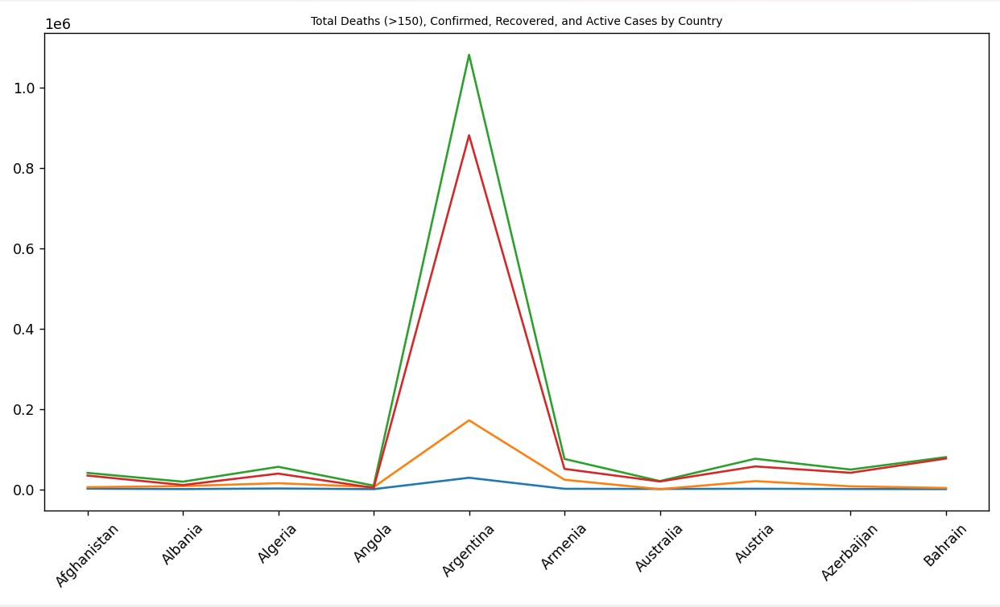
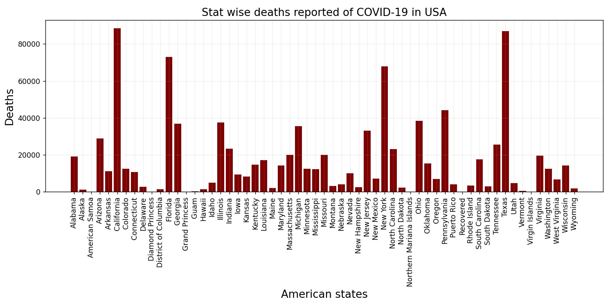
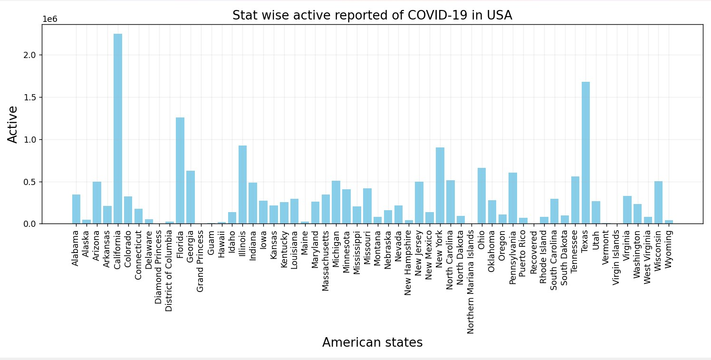
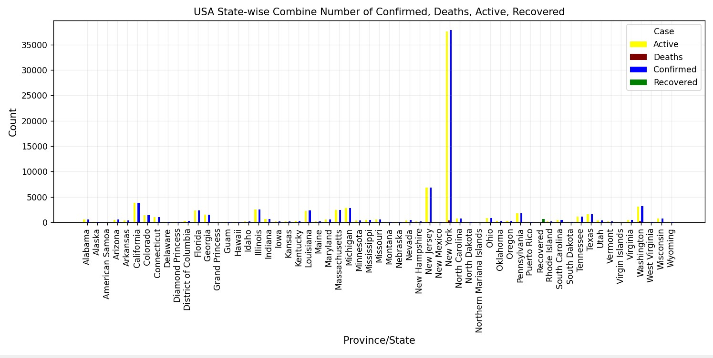

# Analysis and exploration of COVID-19 data using Python

Coronavirus disease is an infectious illness caused by the severe acute respiratory syndrome coronavirus 2 (SARS-CoV-2). It was first identified in Wuhan, China, in 2019, and since then, it has spread globally, leading to the COVID-19 pandemic in 2019–2020. Based on the provided COVID-19 dataset from patients infected with the virus, I have conducted several analyses.

## 1) Display information and dataset of COVID-19

```python
def tamrin1(f):
        read=pd.read_csv(f)
        head_file=read.head(6)
        print(head_file)
        print('Dataset Information: ''\n')
        print(head_file.info())
tamrin1(random_file("/content/Covid19"))
```

**Output:**

```text
   FIPS Admin2 Province_State       Country_Region          Last_Update  \
0   NaN    NaN            NaN          Afghanistan  2021-02-26 05:22:40   
1   NaN    NaN            NaN              Albania  2021-02-26 05:22:40   
2   NaN    NaN            NaN              Algeria  2021-02-26 05:22:40   
3   NaN    NaN            NaN              Andorra  2021-02-26 05:22:40   
4   NaN    NaN            NaN               Angola  2021-02-26 05:22:40   
5   NaN    NaN            NaN  Antigua and Barbuda  2021-02-26 05:22:40   
        Lat      Long_  Confirmed  Deaths  Recovered  Active  \
0  33.93911  67.709953      55680    2438      49281    3961   
1  41.15330  20.168300     104313    1736      67158   35419   
2  28.03390   1.659600     112622    2973      77683   31966   
3  42.50630   1.521800      10799     110      10356     333   
4 -11.20270  17.873900      20695     502      19238     955   
5  17.06080 -61.796400        701      14        271     416   
          Combined_Key  Incident_Rate  Case_Fatality_Ratio  
0          Afghanistan     143.032039             4.378592  
1              Albania    3624.748071             1.664222  
2              Algeria     256.828555             2.639804  
3              Andorra   13976.574128             1.018613  
4               Angola      62.967295             2.425707  
5  Antigua and Barbuda     715.832040             1.997147  
```
```text
Dataset Information: 
<class 'pandas.core.frame.DataFrame'>
RangeIndex: 6 entries, 0 to 5
Data columns (total 14 columns):
 #   Column               Non-Null Count  Dtype  
---  ------               --------------  -----  
 0   FIPS                 0 non-null      float64
 1   Admin2               0 non-null      object 
 2   Province_State       0 non-null      object 
 3   Country_Region       6 non-null      object 
 4   Last_Update          6 non-null      object 
 5   Lat                  6 non-null      float64
 6   Long_                6 non-null      float64
 7   Confirmed            6 non-null      int64  
 8   Deaths               6 non-null      int64  
 9   Recovered            6 non-null      int64  
 10  Active               6 non-null      int64  
 11  Combined_Key         6 non-null      object 
 12  Incident_Rate        6 non-null      float64
 13  Case_Fatality_Ratio  6 non-null      float64
dtypes: float64(5), int64(4), object(5)
memory usage: 800.0+ bytes
```
---

## 2) Line chart

Plotting a line chart of total deaths, confirmed cases, recovered cases, and active cases for countries where the number of deaths exceeds 150.

```python
def tamrin2(f):
    read=pd.read_csv(f)
    read=read[read["Deaths"] > 150]
    name_col=['Active','Confirmed','Deaths','Recovered',"Country_Region"]
    new_df=read[name_col].head(10)
    plt.figure(figsize=(8,6))
    plt.title('Total Deaths (>150), Confirmed, Recovered, and Active Cases by
Country',fontsize=8,color='black')
    plt.plot(new_df['Country_Region'],new_df['Deaths'])
    plt.plot(new_df['Country_Region'],new_df['Active'])
    plt.plot(new_df['Country_Region'],new_df['Confirmed'])
    plt.plot(new_df['Country_Region'],new_df['Recovered'])
    plt.xticks(rotation=45)
    plt.tight_layout()
    plt.show()
tamrin2(random_file("/content/Covid19"))
```
**Output:**



---

## 3) Bar chart

Plotting observed death cases across the states of the United States.

```python
def tamrin3(f):
    read=pd.read_csv(f)
    country_group=read.groupby(['Country_Region'])
    US_group=country_group.get_group('US')
    stat_group=US_group.groupby(['Province_State'])
    sum_deaths_group=stat_group['Deaths'].agg(sum)

    plt.figure(figsize=(10,6))
    plt.title('Stat wise deaths reported of COVID-19 in USA',fontsize=15,color='black')
    plt.bar(sum_deaths_group.index,sum_deaths_group.values,color='maroon',width=0.8)
    plt.ylabel('Deaths',fontsize=15)
    plt.xlabel('American states',fontsize=15)
    plt.xticks(rotation=90)
    plt.grid(alpha=0.2)
    plt.tight_layout()
    plt.show()

tamrin3(random_file("/content/Covid19"))
```

**Output:**


---

Plotting observed active cases across the states of the United States.

```python
def tamrin4(f):
    read=pd.read_csv(f)
    country_group=read.groupby(['Country_Region'])
    US_group=country_group.get_group('US')
    stat_group=US_group.groupby(['Province_State'])
    sum_active_group=stat_group['Active'].agg(sum)

    plt.figure(figsize=(12,6))
    plt.title('Stat wise active reported of COVID-19 in USA',fontsize=15,color='black')
    plt.bar(sum_active_group.index,sum_active_group.values,color='skyblue',width=0.8)
    plt.ylabel('Active',fontsize=15)
    plt.xlabel('American states',fontsize=15)
    plt.xticks(rotation=90)
    plt.grid(alpha=0.2)
    plt.tight_layout()
    plt.show()
tamrin4(random_file("/content/Covid19"))
```
**Output:**


---

Plotting observed confirmed cases, deaths, recovered cases, and active cases across the states of the United States.

```python
def tamrin5(f):
    read=pd.read_csv(f)
    country_group=read.groupby(['Country_Region'])
    US_group=country_group.get_group('US')
    state_group=US_group.groupby(['Province_State'])
    sum_active_group=state_group['Active'].agg(sum)
    sum_deaths_group=state_group['Deaths'].agg(sum)
    sum_confirmed_group=state_group['Confirmed'].agg(sum)
    sum_recovered_group=state_group['Recovered'].agg(sum)

    x = np.arange(len(sum_active_group))
    plt.figure(figsize=(12, 6))
    plt.title('USA State-wise Combine Number of Confirmed, Deaths, Active, Recovered',
 fontsize=12, color='black')
    plt.bar(x - 1.5 * 0.2, sum_active_group, width=0.2, label='Active', color='yellow')
    plt.bar(x - 0.5 * 0.2, sum_deaths_group, width=0.2, label='Deaths', color='maroon')
    plt.bar(x + 0.5 * 0.2, sum_confirmed_group, width=0.2, label='Confirmed', color='blue')
    plt.bar(x + 1.5 * 0.2, sum_recovered_group, width=0.2, label='Recovered', color='green')
    plt.ylabel('Count', fontsize=12)
    plt.xlabel('Province/State', fontsize=12)
    plt.xticks(x, sum_active_group.index, rotation=90)
    plt.grid(alpha=0.2)
    plt.legend(title='Case')
    plt.tight_layout()
    plt.show()
tamrin5(random_file("/content/Covid19"))
```
**Output:**

